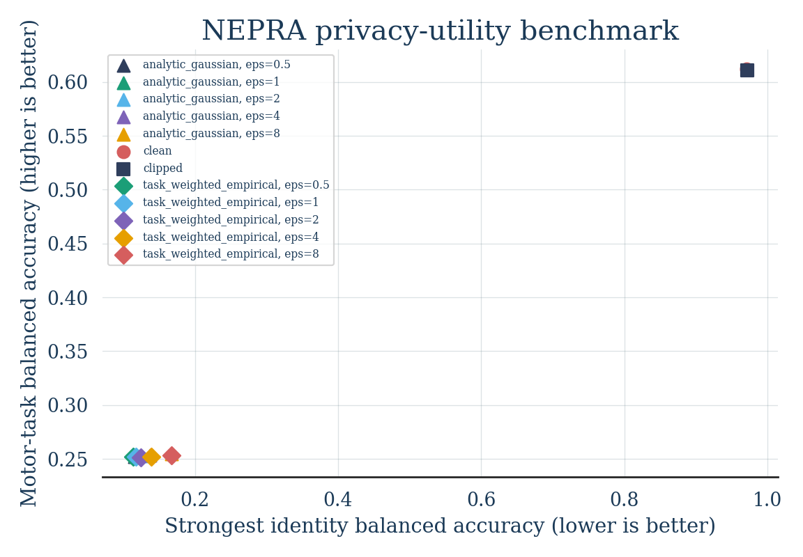

# v0.1 Benchmark Results

## Setup

- Dataset: `BNCI2014_001`
- Subjects: 9
- Sessions: `0train` calibration, `1test` evaluation
- Classes: left hand, right hand, feet, tongue
- Calibration trials: 2,592
- Held-out trials: 2,592
- Tangent dimensions: 253
- Noise seeds: 5
- Hardware: Intel Core i7-1255U, 12 logical CPUs, 18 GiB RAM
- Wall-clock runtime: 8 minutes 37 seconds
- Peak resident memory: 2.05 GiB

The complete aggregate output is stored in
[`docs/results/v0.1/summary.json`](results/v0.1/summary.json).

## Diagnostics

The calibration clipping norm was `C = 19.5695`.

- Calibration trials clipped: 5.02%
- Held-out trials clipped: 10.30%
- Held-out/calibration p95 norm ratio: 1.0595
- Empirical weight range: 0.2749 to 1.0911
- Empirical weight RMS: 1.0

The higher held-out clipping rate shows measurable cross-session drift, but
clipping alone changed motor-task accuracy by only 0.12 percentage points.

## Privacy-Utility Results

Balanced accuracy is shown below. Motor-task chance is 25%; identity chance is
11.11%.

| Condition | Epsilon | Motor task | 95% subject bootstrap CI | Strongest identity attack |
|---|---:|---:|---:|---:|
| Clean | - | 61.23% | 53.66-69.25% | 97.07% |
| Clipped | - | 61.11% | 53.59-69.21% | 97.18% |
| Analytic Gaussian | 0.5 | 25.22% | 24.09-26.24% | 11.53% |
| Analytic Gaussian | 1.0 | 25.28% | 24.13-26.27% | 11.61% |
| Analytic Gaussian | 2.0 | 25.25% | 24.13-26.25% | 12.41% |
| Analytic Gaussian | 4.0 | 25.32% | 24.37-26.20% | 13.70% |
| Analytic Gaussian | 8.0 | 25.46% | 24.60-26.29% | 16.71% |
| Task-aware empirical | 0.5 | 25.22% | 24.37-26.10% | 11.40% |
| Task-aware empirical | 1.0 | 25.22% | 24.39-26.10% | 11.72% |
| Task-aware empirical | 2.0 | 25.15% | 24.31-26.03% | 12.45% |
| Task-aware empirical | 4.0 | 25.21% | 24.37-26.13% | 13.88% |
| Task-aware empirical | 8.0 | 25.33% | 24.30-26.43% | 16.67% |

## Interpretation

The clean tangent representation retained useful motor-imagery information and
also exposed highly identifying subject structure across sessions.

The analytic Gaussian mechanism strongly reduced the tested identity attacks,
but every configured epsilon also destroyed motor-task utility. This is
consistent with the cost of applying a conservative trial-level local
mechanism with replace-one sensitivity `2C` to a high-dimensional vector.

The task-aware empirical allocation did not recover utility at matched expected
noise energy. Its results closely tracked the isotropic mechanism and therefore
do not support the original hypothesis that task-coefficient weighting improves
the trade-off in this setup.

These findings do not prove that adaptive perturbation is generally
ineffective. They show that this specific weighting rule, representation,
calibration, and noise budget did not produce a useful operating point.

